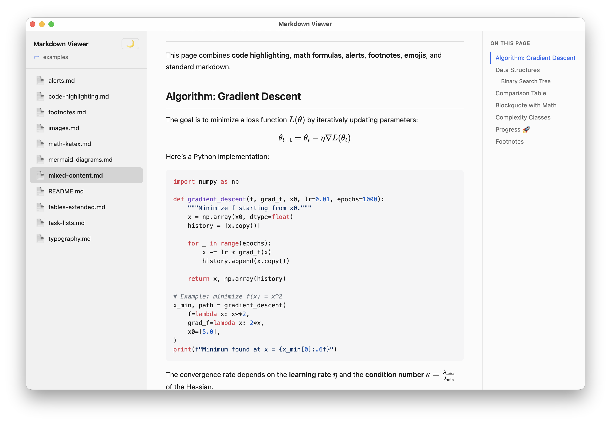
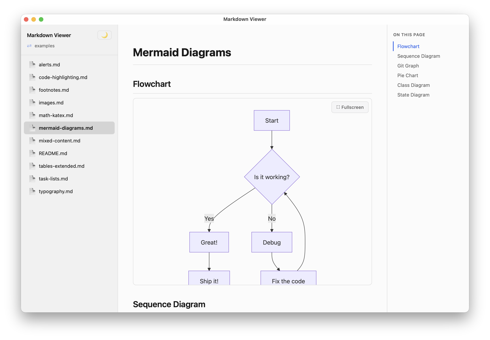

# MacMarkdownViewer

[](https://github.com/nprudhomme/MacMarkdownViewer/actions/workflows/ci.yml)
[](https://opensource.org/licenses/MIT)
[](https://github.com/nprudhomme/MacMarkdownViewer/releases/latest)
[](https://github.com/nprudhomme/MacMarkdownViewer/releases/latest)
[](https://v2.tauri.app/)

A native macOS Markdown viewer built with [Tauri v2](https://v2.tauri.app/). Browse folders, read `.md` files with a clean rendered view, navigate between documents, and enjoy a native experience with dark mode support.

> **[Documentation](https://nprudhomme.github.io/MacMarkdownViewer/)**

<p align="center">
  
</p>

<p align="center">
  
  
</p>

## Features

### Core

- **Folder browsing** — Open any folder and navigate its directory tree via the sidebar
- **Outline panel** — Auto-generated table of contents (h2/h3) with scroll tracking
- **Relative link navigation** — Click `.md` links to navigate between documents
- **Dark mode** — Follows macOS system appearance, toggleable manually
- **Session persistence** — Remembers your last opened folder across launches
- **CLI support** — Open a folder directly: `mdv ~/docs`
- **Native menu** — Cmd+O to open a folder, standard macOS app menu

### Markdown Rendering

- **GitHub-Flavored Markdown** — Headings, tables, code blocks, blockquotes, task lists, strikethrough
- **Syntax highlighting** — Code blocks with language detection via [highlight.js](https://highlightjs.org/)
- **Math (KaTeX)** — Inline `$...$` and display `$$...$$` math expressions
- **Mermaid diagrams** — Rendered diagrams with fullscreen view
- **GitHub Alerts** — `[!NOTE]`, `[!TIP]`, `[!WARNING]`, `[!IMPORTANT]`, `[!CAUTION]`
- **Footnotes** — Reference-style footnotes with backlinks
- **Smart typography** — Curly quotes, em/en dashes, ellipses
- **Emoji shortcodes** — `:rocket:`, `:heart:`, `:fire:` and 80+ more
- **Extended tables** — Colspan via `||` syntax
- **Copy button** — One-click code block copying
- **Image lightbox** — Click any image to view fullscreen
- **Task list checkboxes** — `- [x]` and `- [ ]` rendered as checkboxes

### Security

All rendered HTML is sanitized through [DOMPurify](https://github.com/cure53/DOMPurify) before being displayed. This protects against:

- **Script injection** — `<script>` tags are stripped
- **Event handler XSS** — `onerror`, `onclick`, `onload`, `ontoggle` attributes are removed
- **JavaScript URIs** — `href="javascript:..."` links are neutralized
- **Iframe injection** — `<iframe>` elements are stripped

Safe content like KaTeX math output, MathML, checkboxes, and footnote attributes are preserved through a configured allowlist.

## Examples

The app includes a built-in **View examples** button on the welcome screen that loads sample documents showcasing all supported features. These examples are also available in the [`examples/`](examples/) directory.

## Download

Download the latest `.dmg` from the [Releases](https://github.com/nprudhomme/MacMarkdownViewer/releases) page. The app is signed and notarized by Apple.

## Build from Source

### Prerequisites

- [Node.js](https://nodejs.org/) >= 18
- [Rust](https://rustup.rs/) (stable)
- macOS with Xcode Command Line Tools

### Steps

```bash
# Clone the repo
git clone git@github.com:nprudhomme/MacMarkdownViewer.git
cd MacMarkdownViewer

# Install dependencies
npm install

# Run in development mode
npm run tauri dev

# Build for production (.app + .dmg)
npm run tauri build
```

The built app will be at `src-tauri/target/release/bundle/macos/Markdown Viewer.app`.

## Usage

### GUI

1. Launch the app
2. Click **Open folder** or press **Cmd+O**
3. Select a folder containing `.md` files
4. Browse and read your documentation

### CLI

```bash
# Open a specific folder
./src-tauri/target/release/mdv ~/my-docs

# Or after installing the .app
/Applications/Markdown\ Viewer.app/Contents/MacOS/mdv ~/my-docs
```

## Tech Stack

- **[Tauri v2](https://v2.tauri.app/)** — Native app shell with Rust backend
- **[Vite](https://vite.dev/)** — Frontend build tool
- **[TypeScript](https://www.typescriptlang.org/)** — Type-safe frontend logic
- **[marked](https://marked.js.org/)** — Markdown parser with extensions:
  - [marked-alert](https://github.com/bent10/marked-extensions/tree/main/packages/alert) — GitHub-style alerts
  - [marked-footnote](https://github.com/bent10/marked-extensions/tree/main/packages/footnote) — Footnotes
  - [marked-highlight](https://github.com/markedjs/marked-highlight) — Syntax highlighting
  - [marked-katex-extension](https://github.com/UziTech/marked-katex-extension) — KaTeX math
  - [marked-smartypants](https://github.com/bent10/marked-extensions/tree/main/packages/smartypants) — Smart typography
  - [marked-extended-tables](https://github.com/bent10/marked-extensions/tree/main/packages/extended-tables) — Extended tables
  - [marked-emoji](https://github.com/UziTech/marked-emoji) — Emoji shortcodes
- **[Mermaid](https://mermaid.js.org/)** — Diagram rendering
- **[highlight.js](https://highlightjs.org/)** — Code syntax highlighting
- **[DOMPurify](https://github.com/cure53/DOMPurify)** — HTML sanitization
- **Tauri plugins** — `fs` (file access), `dialog` (folder picker), `store` (persistence)

## License

[MIT](LICENSE)
