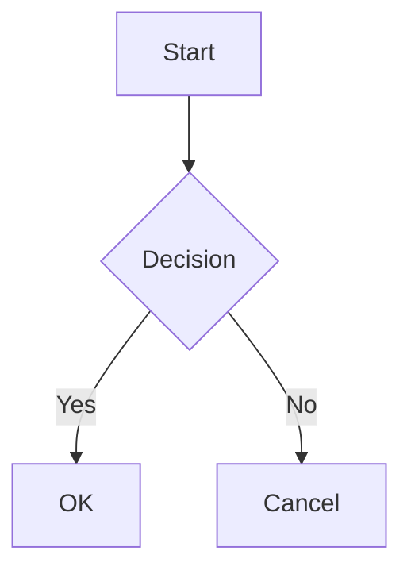

# Features

## Folder Browsing

Open any folder and navigate its directory tree via the sidebar. The sidebar shows directories first (sorted alphabetically), then `.md` files. Dotfiles and non-Markdown files are filtered out.

A breadcrumb bar at the top shows your current location and lets you navigate back to parent directories.

## Markdown Rendering

Full GitHub-Flavored Markdown (GFM) support including:

- Headings with auto-generated IDs
- Tables (with extended colspan via `||`)
- Code blocks with syntax highlighting
- Blockquotes
- Task lists with checkboxes
- Strikethrough
- Links and images

## GitHub Alerts

Support for GitHub-style alert callouts:

```markdown
> [!NOTE]
> Useful information

> [!TIP]
> Helpful advice

> [!WARNING]
> Something to be careful about

> [!IMPORTANT]
> Critical information

> [!CAUTION]
> Potential risks
```

## Footnotes

Reference-style footnotes with automatic backlinks:

```markdown
Here is a statement[^1].

[^1]: This is the footnote content.
```

## Math (KaTeX)

Inline math with `$...$` and display math with `$$...$$`:

```markdown
Inline: $E = mc^2$

Display:
$$\int_0^\infty e^{-x^2} dx = \frac{\sqrt{\pi}}{2}$$
```

## Mermaid Diagrams

Fenced code blocks with the `mermaid` language are rendered as diagrams. Each diagram has a fullscreen button for detailed viewing. Syntax errors show the source code as a fallback.

````markdown

````

## Syntax Highlighting

Code blocks are highlighted with [highlight.js](https://highlightjs.org/). Specify the language after the opening fence, or let auto-detection pick it up.

A **Copy** button appears on each code block for quick copying.

## Smart Typography

Straight quotes are automatically converted to curly quotes. Apostrophes, em dashes, en dashes, and ellipses are also handled:

| Input | Output |
|---|---|
| `"hello"` | "hello" |
| `don't` | don't |
| `---` | em dash |
| `--` | en dash |
| `...` | ellipsis |

## Emoji Shortcodes

Over 80 emoji shortcodes are supported:

```markdown
:rocket: :heart: :fire: :star: :tada:
```

## Image Lightbox

Click any image in the rendered Markdown to open it in a fullscreen overlay. Press **Escape** or click outside the image to close.

## Outline Panel

An auto-generated table of contents appears on the right side, built from `h2` and `h3` headings. The active heading is highlighted as you scroll through the document.

## Dark Mode

The app follows macOS system appearance by default. Click the theme toggle button (sun/moon icon) to switch manually. Your preference is persisted across sessions.

## PDF Export

Click the PDF button in the sidebar header to export the current document as a PDF file. The export uses the native macOS `WKWebView.createPDF` API for high-quality rendering. A save dialog opens with a default filename based on the current markdown file. UI elements (sidebar, outline) are hidden during capture so only the document content is exported.

## Session Persistence

The app remembers the last opened folder and restores it on next launch.

## Relative Link Navigation

Click any `.md` link in a document to navigate to that file. Anchor links (`#section`) scroll to the target heading. External links open in the default browser.
