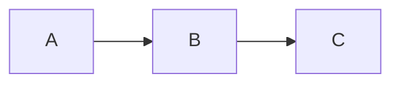

# Markdown Support

Markdown Viewer supports the full [GitHub-Flavored Markdown](https://github.github.com/gfm/) specification plus several extensions.

## Standard Markdown

| Syntax | Support |
|---|---|
| Headings (`#` to `######`) | Auto-generated IDs for linking |
| Bold, italic, strikethrough | `**bold**`, `*italic*`, `~~strike~~` |
| Links | Internal `.md` links navigated in-app |
| Images | Clickable with lightbox overlay |
| Blockquotes | Standard rendering |
| Ordered/unordered lists | Including nested lists |
| Horizontal rules | `---`, `***`, `___` |
| Inline code | Backtick syntax |

## GFM Extensions

| Feature | Syntax | Library |
|---|---|---|
| Tables | Pipe syntax | Built-in GFM |
| Task lists | `- [x]` / `- [ ]` | Built-in GFM |
| Strikethrough | `~~text~~` | Built-in GFM |
| Autolinks | URLs auto-linked | Built-in GFM |

## Plugin Extensions

### GitHub Alerts

```markdown
> [!NOTE]
> Informational note

> [!TIP]
> Helpful tip

> [!IMPORTANT]
> Important information

> [!WARNING]
> Warning message

> [!CAUTION]
> Caution notice
```

### Footnotes

```markdown
Text with a footnote reference[^1].

[^1]: The footnote content appears at the bottom.
```

### Math (KaTeX)

Inline math: `$E = mc^2$`

Display math:
```markdown
$$
\sum_{i=1}^{n} i = \frac{n(n+1)}{2}
$$
```

Supports the full [KaTeX function catalog](https://katex.org/docs/supported).

### Mermaid Diagrams

````markdown

````

Supports all [Mermaid diagram types](https://mermaid.js.org/): flowcharts, sequence diagrams, class diagrams, state diagrams, ER diagrams, Gantt charts, and more.

Diagrams include a fullscreen button. Syntax errors display the source code as fallback.

### Syntax Highlighting

````markdown
```python
def hello():
    print("Hello, world!")
```
````

Language detection is automatic when no language is specified. Supported languages include all [highlight.js languages](https://highlightjs.org/download).

### Extended Tables

Colspan via `||`:

```markdown
| Header 1 | Header 2 |
|---|---|
| This spans both columns ||
```

### Smart Typography

| Input | Output |
|---|---|
| `"quotes"` | Curly double quotes |
| `'quotes'` | Curly single quotes |
| `don't` | Smart apostrophe |
| `---` | Em dash (—) |
| `--` | En dash (–) |
| `...` | Ellipsis (…) |

### Emoji Shortcodes

Use `:name:` syntax. Available shortcodes:

| Shortcode | Emoji | | Shortcode | Emoji |
|---|---|---|---|---|
| `:rocket:` | :rocket: | | `:heart:` | :heart: |
| `:fire:` | :fire: | | `:star:` | :star: |
| `:check:` | :white_check_mark: | | `:x:` | :x: |
| `:warning:` | :warning: | | `:bulb:` | :bulb: |
| `:tada:` | :tada: | | `:sparkles:` | :sparkles: |
| `:bug:` | :bug: | | `:gear:` | :gear: |
| `:lock:` | :lock: | | `:shield:` | :shield: |
| `:coffee:` | :coffee: | | `:zap:` | :zap: |

And 70+ more — see the full list in the source code.
