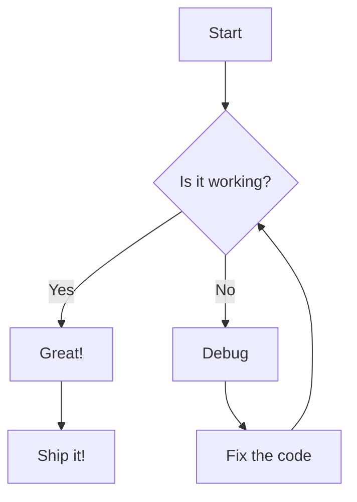
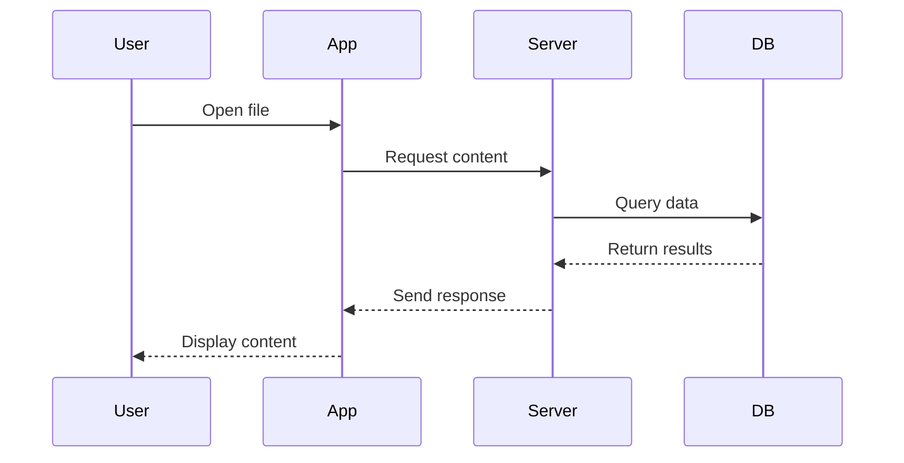
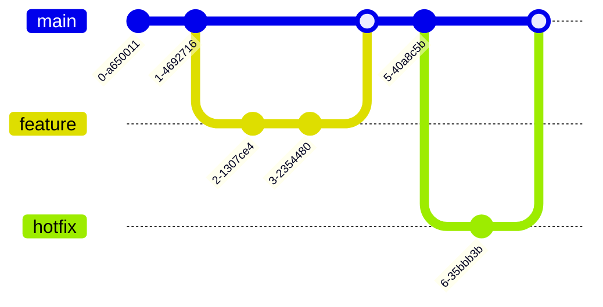
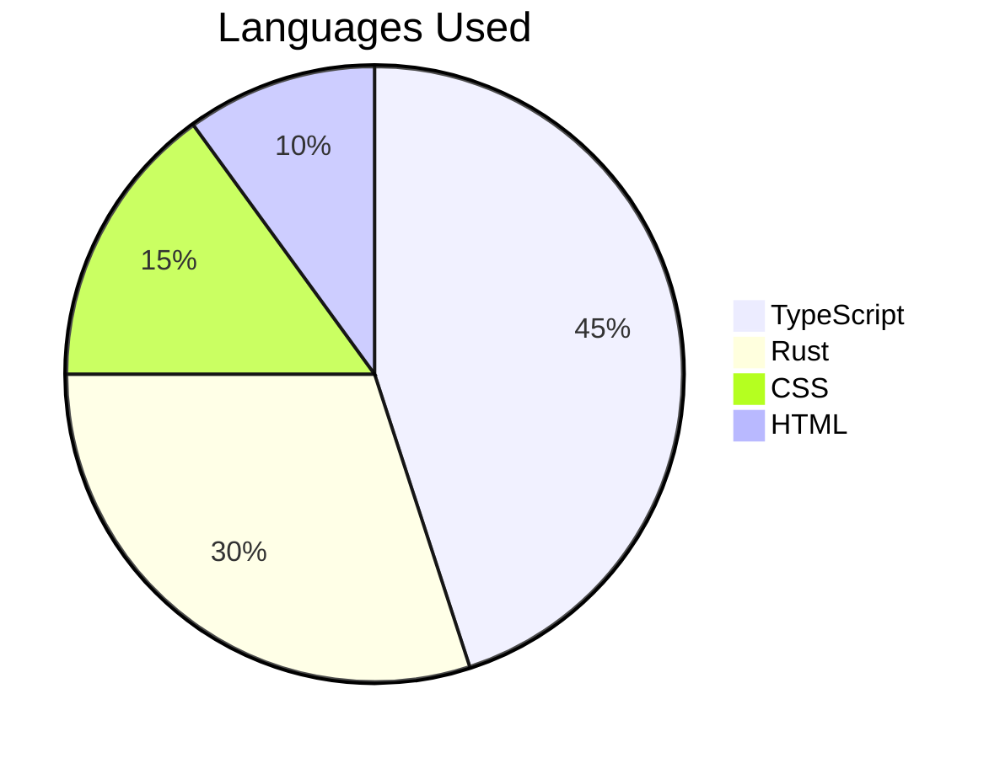
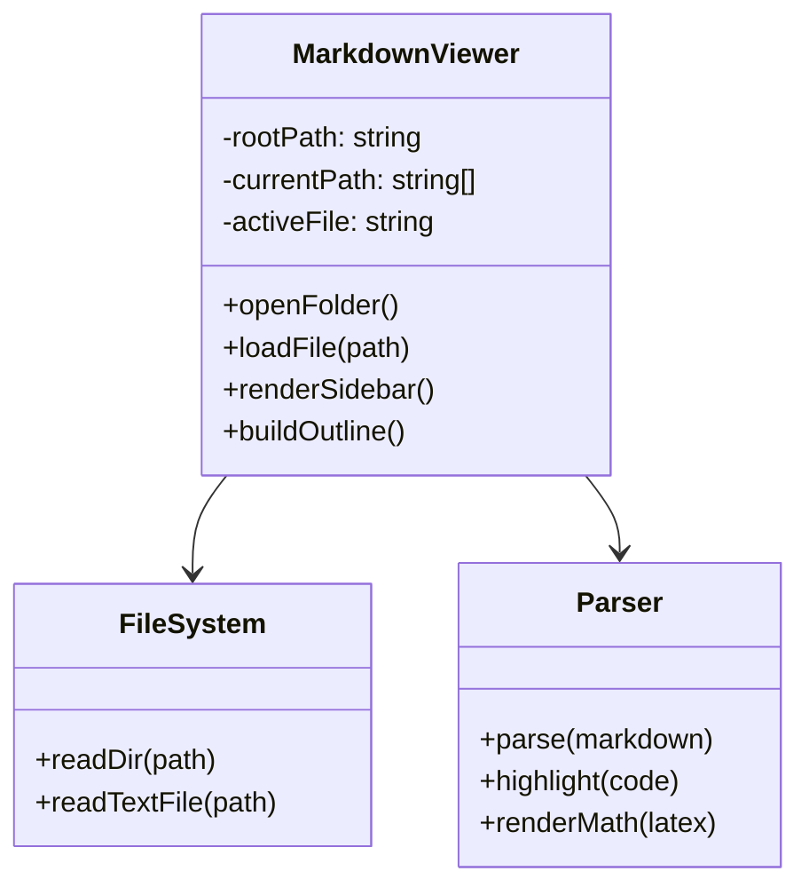
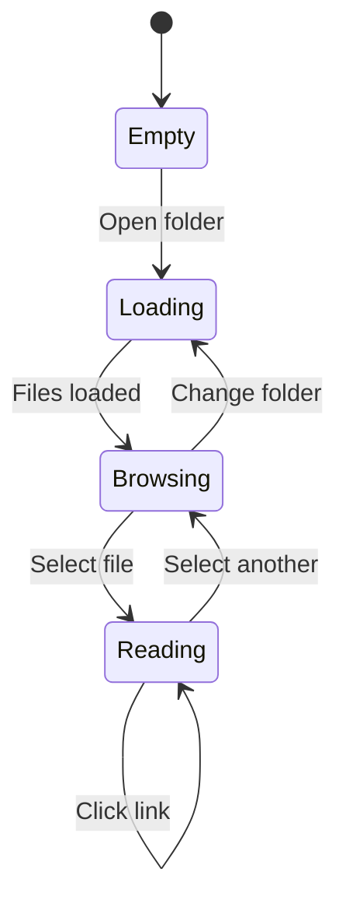

# Mermaid Diagrams

## Flowchart

```mermaid
graph TD
    A[Start] --> B{Is it working?}
    B -->|Yes| C[Great!]
    B -->|No| D[Debug]
    D --> E[Fix the code]
    E --> B
    C --> F[Ship it!]
```

## Sequence Diagram

```mermaid
sequenceDiagram
    participant User
    participant App
    participant Server
    participant DB

    User->>App: Open file
    App->>Server: Request content
    Server->>DB: Query data
    DB-->>Server: Return results
    Server-->>App: Send response
    App-->>User: Display content
```

## Git Graph

```mermaid
gitGraph
    commit
    commit
    branch feature
    checkout feature
    commit
    commit
    checkout main
    merge feature
    commit
    branch hotfix
    commit
    checkout main
    merge hotfix
```

## Pie Chart

```mermaid
pie title Languages Used
    "TypeScript" : 45
    "Rust" : 30
    "CSS" : 15
    "HTML" : 10
```

## Class Diagram

```mermaid
classDiagram
    class MarkdownViewer {
        -rootPath: string
        -currentPath: string[]
        -activeFile: string
        +openFolder()
        +loadFile(path)
        +renderSidebar()
        +buildOutline()
    }
    class FileSystem {
        +readDir(path)
        +readTextFile(path)
    }
    class Parser {
        +parse(markdown)
        +highlight(code)
        +renderMath(latex)
    }
    MarkdownViewer --> FileSystem
    MarkdownViewer --> Parser
```

## State Diagram

```mermaid
stateDiagram-v2
    [*] --> Empty
    Empty --> Loading: Open folder
    Loading --> Browsing: Files loaded
    Browsing --> Reading: Select file
    Reading --> Browsing: Select another
    Browsing --> Loading: Change folder
    Reading --> Reading: Click link
```
